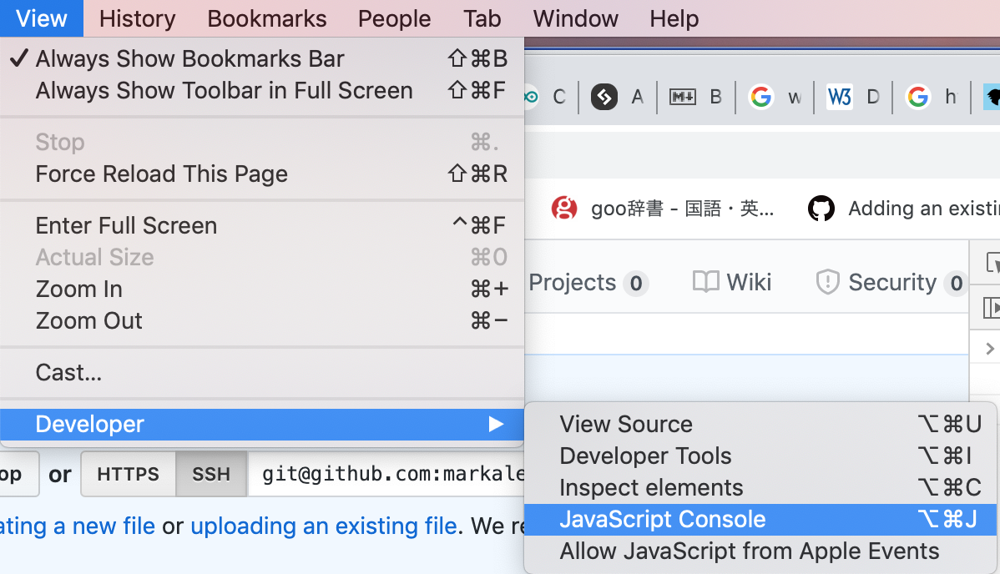
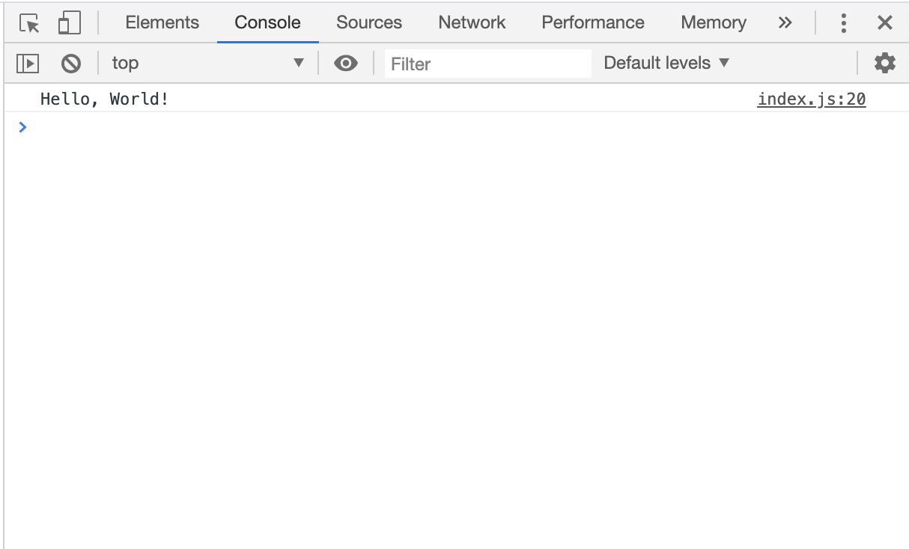

# Week Two

## Goals
1. Understand the basics of JavaScript.
2. Write a series of basic programs using for loops, conditionals and functions.
3. Manipulate HTML elements with JavaScript.

***

## Background

Though it's possible to build perfectly acceptable webpages without JavaScript, JavaScript is fundamental when you want to add any interactivty to a page. Though you can build perfectly servicable apps using only HTML, CSS and whatever you use for the server (Python, Node.js, PHP, Ruby, etc), JavaScript is the only way to add functionality on the client side.

***

## Getting started

As I mentioned last week, the first thing we learn in any language is the _Hello, World!_ program, so let's begin. 

There's a little bit of setup required here but it shouldn't take too long.

Open VSCode and start a new Terminal window. Type `pwd` and should should be in `/Users/<username>`. If you type `ls` you should see the list of folders, including the `skillshare` directory you created last time. Enter `cd skillshare` to enter that directory, from there create a directory for week two with `mkdir week-two` and `cd` into that with `cd week-two`.

Since we don't have Node.js installed (more on that later), we need a webpage to run our JavaScript files, so let's go ahead and create our index page by entering `touch index.html` into the Terminal.

In your `index.html` file, enter the following code:

```
<!DOCTYPE html>
<html lang="en">
    <head>
        <meta charset="utf-8">
        <title>Hello, World!</title>
    </head>
    <body>
    </body>
</html>
```

By now this setup should look familiar. I haven't included a link to any stylesheets because we won't need styling this week.

Next, we'll need to create a JavaScript file so go to your Terminal and type `touch index.js`. Open your `index.js` file and add:

```
console.log("Hello, World!")
```

Next, we'll need to include our JavaScript file in our HTML page. To include it, we add `<script src="index.js"></script>` where `src` means _source_.

We have two options here for where to include this `script` tag. We can either include it between our `<head></head>` tags or we can put it _right_ at the very end just before our closing body tag `</body>`.


#### Head
```
    <head>

        ...

        <script src="index.js"></script>
    </head>

```

#### End of body element
```
    <body>

        ...

        <script src="index.js"></script>
    </body>
```

There are pros and cons to each approach.

HTML loads from top to bottom so if your script is trying to manipulate elements in your page it may not run correctly because the elements in between your `<body></body>` tags won't have loaded by the time the script executes.

However, if you have scripts relying on external libraries that take a while to load (e.g. Google Maps API), it may be beneficial to add the link to an external script in the `head` and add the link to your own script right before the closing `body` tag, so that any external scripts are available before your script runs.

It doesn't matter to our _Hello, World!_ program where the script goes but I've chosen here to include it in the `head`.

```
<!DOCTYPE html>
<html lang="en">
    <head>
        <meta charset="utf-8">
        <title>Hello, World!</title>
        <script src="index.js"></script>
    </head>
    <body>
    </body>
</html>
```

As with last week, let's start a local web server to host our page. Enter `python -m SimpleHTTPServer 8000` into the Terminal and then enter `localhost:8000` into the browser search bar. Don't forget to split your Terminal windows so you can still use the Terminal while the local server is running.

To open your console:



You should now see "Hello, World!" printed in your browser console.



### Using the console

The console is invaluable when debugging an application. In practice, the console can tell your all sorts of things:

- If your CSS isn't working, it can identify that the resource can't be found (i.e. there is no stylesheet located where you've written in your `<link href="">` attribute).

- If your scripts aren't working, it will identify why and the line in your code that isn't working (e.g. a syntax error if you've mistyped a variable name or added a character where you shouldn't have).

- In larger applications, it may display HTTP errors if a resource your site has requested doesn't exist (404) or if you don't have access (403).

- When returning data from an API, you can log the response from the API to figure out the data structure of the response, which really helps when you have poorly documented APIs.

```
console.log("Hello, World")
```

Throughout this session, if you want to see the output of anything you'll need to log it to the console.

```
var x = 1
console.log(x)
```

You should see a 1 printed in the console.


### Variables

Until recently in JavaScript it was only possible to declare variables using the keyword `var`.


#### `var`

Weakest assignment.

When we reassign the variable, we don't need to include the keyword `var`; we just type the variable name again.

```
var x = 5
console.log(x)

x = 10
console.log(x)
```

In some languages, e.g. Python, you don't need to add the `var` at all.


#### `let`

May or may not be reassigned.

`let`

#### `const`

JavaScript now supports two other declarations; `let` and `const`.

`const` indicates the variable is a constant and that the value will not be reassigned throughout the program. `const`s should be declared at the top of your program and can be declared in capitals.

```
const VAT_RATE = 0.2
```

Attempting to reassign the value of a constant will cause a `TypeError` error.

```
const VALUE_OF_PI = 3.142

console.log(VALUE_OF_PI)

const VALUE_OF_PI = 3.14159
```


### Data types

A note on types. JavaScript is what's called a weakly-typed language, meaning you don't need to declare what _type_ of value will be stored in a variable.

JavaScript is a very forgiving language and it's acceptable to do the following:

```
var weekday = "Monday"

weekday = 0
```

Other languages, such as C or Java are strongly-typed which means you have to declare the type of value stored in the variable.

```
int speakerPin = 6;

float c_frequency = 65.41;
```

Pretty much the only data types we'll need are:

- `string` - a text string, e.g. `"Hello, World!"`.

- `number` - JavaScript doesn't distinguish between integers and floating point numbers.

- `boolean` - either `true` or `false`.


### Best practice

To make your life easier - and for the sake of anyone else reading your code - your variable names should refer to the sort of value you're storing in the variable.


##### Don't

```
var x = "hello@world.com"

var y = 2020

var z = true
```

##### Do

```
var email = "hello@world.com"

var current_year = 2020

var condition = true
```

Variable names should be lowercase or uppercase characters and should not contain spaces.

##### Don't

```
var 5

var my variable
```

##### Do

```
var five

var my_variable
```

One last point on naming conventions. There are two prevalent conventions for naming variables, objects and functions within Javascript; snake case and camel case. In snake case, each word is separated by an underscore whereas in camel case the name begins with lowercase and each new word begins with a capital. For example:

#### Snake case

```
var my_variable

var value_added_tax_rate

let number_of_loop_iterations
```

#### Camel case

```
var myVariable

var valueAddedTaxRate

let numberOfLoopIterations
```

Generally speaking, camel case is more easily readable for programmers whose first language is not English, which may explain why it's more common in languages such as Ruby which was created by a Japanese developer.


### Arrays

Another type of data structure is called an array. Arrays are essentially lists of items.

Arrays are declared in JavaScript with square brackets and each item is separated by a comma.

```
var numbers_array = [1, 2, 3, 4, 5]
```

Unlike other languages, it's possible to declare arrays containing different data types in the same array. In fact, you can add pretty much anything to an array in JavaScript.

```
var mixed_data_array = ["Hello", true, 100, "World!"]
```

And of course, you can create arrays of arrays. Arrays of arrays often called a _multidimensional arrays_ but you may also hear them referred to as _nested_.

```
var matrix = [[0,0,0],[0,1,0],[1,0,1]]
```

To identify an item in an array, you need to know it's index. This refers to its position in the array and is zero-indexed. What that means is that the first item in an array is at zero index, the second is at first index, and so on.

Try the following:


For now, we only need to know a few operations that you can perform on an array.


Though I mentioned earlier that it's not possible to reassign a constant, you can add still add items to a constant array.


For loops

Functions

Arrow functions

Conditionals

Objects


## Stretch goals


